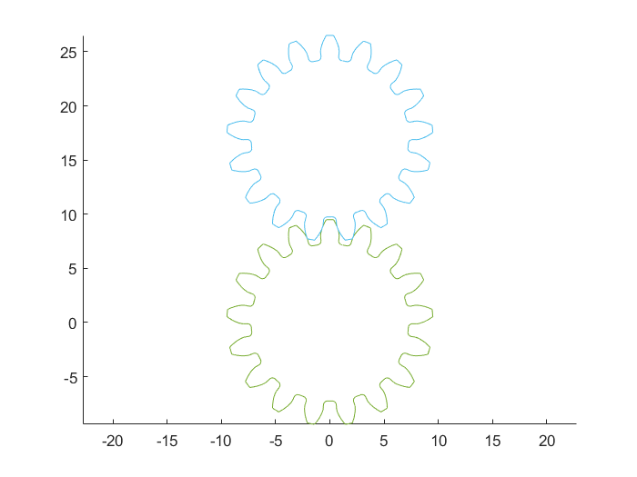
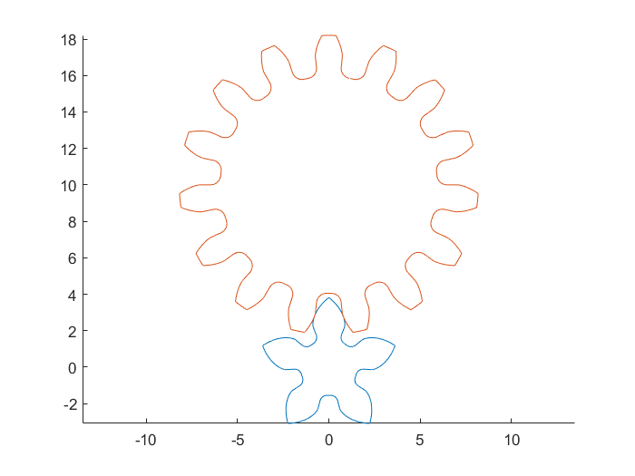

# DrawGearContour
## 作者 Author: Tom Willow

## Introduction

使用MATLAB绘制渐开线齿轮齿廓曲线。齿根部分由直线与圆弧近似。

Draw an involute gear's contour by MATLAB. The gear root contour is approximated by straight line and arc.

运行gear_demo.m可以生成两个齿轮齿廓。

Run gear_demo.m to get two gear contour.

运行gear_2_Demo.m将调用gear_2函数，以绘制2个带变位系数的啮合齿轮的轮廓。

The gear_2_Demo.m demonstrated the function gear_2 that used to draw 2 gear's contour with modification coefficient(X1 X2).

推导过程见 https://www.zhihu.com/question/65957930/answer/239002345

formular derive: https://www.zhihu.com/question/65957930/answer/239002345